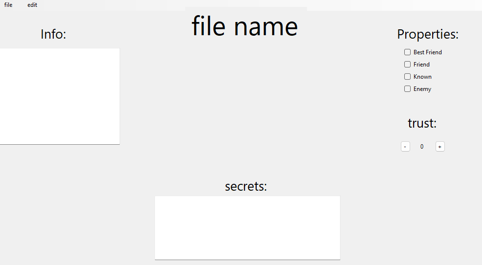

# BlackMailList
 BlackMailList is a program that you can make a file about a person. You can choose if he/she is your friend, trust and more. Why this name is BlackMailList is becuse you can type secrets about them. So if the BlackMail you, you can easily do it to them. You can share the file with anyone and they get access to all the things you have on the file about them.

Introduction: You can Import a bml file and Export a bml file. (bml stands for Black Mail list)
You can also edit a file using visual studio code. there is a template in the templates folder [here.](https://github.com/Fredlike/BlackMailList/tree/main/Templates)

You can download BML by going to releases and [download the latest verson](https://github.com/Fredlike/BlackMailList/releases/tag/1.0) there.

## **Introduction:**

**Step one:** download the zip file and extract it. 

**Step two:** open the BlackMailList.exe file. (it might say that your computer have blocked the app for safety reason. but just ingnore it. its not a virus ir malware)

**step tree:** open or make a file. if you want to open a BML file, go to file/import and just open a bml file. If you dont have any BML files you can download the [template](https://github.com/Fredlike/BlackMailList/tree/main/Templates) file if you want to edit it in text, or just start typing. dont worry if the text on the top says "file name". when you export it just name it what you want and it will show up there. 

**step four:** export it. if you want to export it or save it, go to file/export and name the file. the file name will be showing at the top when you open it again. 